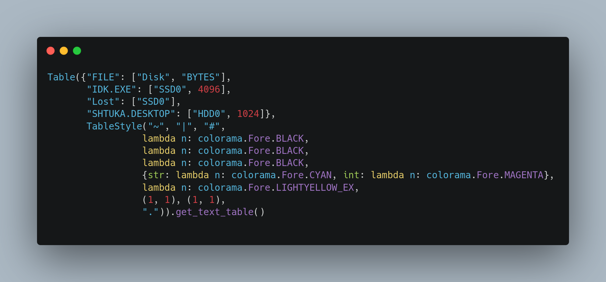
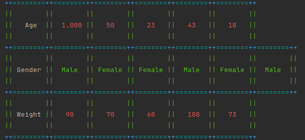

# Table
This is a python table of data implementation with styles, colors
# Example


<details><summary>Code</summary>
```python
Table({"FILE": ["SYSTEM", "BYTES"], "IDK.EXE": ["WINDA", 4096], "SHTUKA.DESKTOP": ["LINUX", 1024]},
      TableStyle("~", "|", "#",
                 CLASSIC_COLOR_LAMBDA, CLASSIC_COLOR_LAMBDA, CLASSIC_COLOR_LAMBDA,
                 {str: lambda n: colorama.Fore.CYAN, int: lambda n: colorama.Fore.MAGENTA},
                 lambda n: colorama.Fore.LIGHTYELLOW_EX,
                 (1, 1), (1, 1),
                 ".")).get_text_table()```
</details>
# Lambda colors


<details><summary>Code</summary>
```python
Table({"FILE": ["SYSTEM", "BYTES"], "IDK.EXE": ["WINDA", 4096], "SHTUKA.DESKTOP": ["LINUX", 1024]},
      TableStyle("~", "|", "#",
                 lambda n: colorama.Fore.BLACK, lambda n: colorama.Fore.BLACK, lambda n: colorama.Fore.BLACK,
                 {str: lambda n: colorama.Fore.CYAN, int: lambda n: colorama.Fore.MAGENTA},
                 lambda n: colorama.Fore.LIGHTYELLOW_EX,
                 (1, 1), (1, 1),
                 ".")).get_text_table()```
</details>
